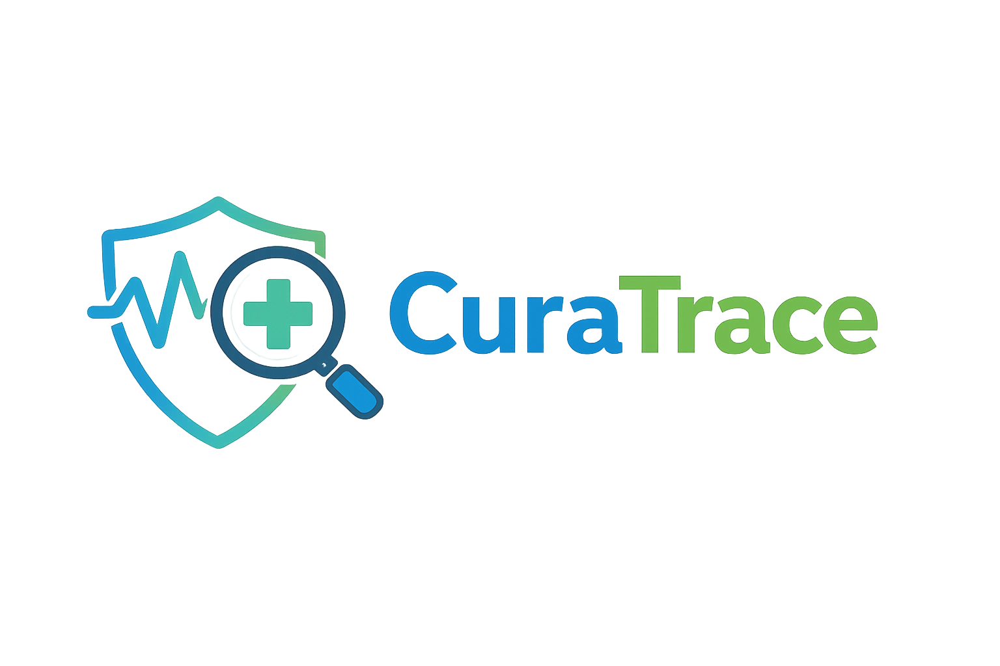

<p align="center">
  
</p>

<h1 align="center">CuraTrace</h1>
<p align="center"><strong>Crowdsourced Treatment Intelligence Platform</strong></p>
<p align="center">
  An AI-powered platform that aggregates real patient discussions from Reddit, PubMed, Drugs.com, and YouTube into structured treatment insights — side effects, effectiveness, sentiment, misinformation detection, alternative approach comparisons, and nearby health center recommendations.
</p>

---

## Table of Contents

- [Overview](#overview)
- [Key Features](#key-features)
- [Architecture](#architecture)
- [Tech Stack](#tech-stack)
- [Getting Started](#getting-started)
- [Environment Variables](#environment-variables)
- [API Reference](#api-reference)
- [Project Structure](#project-structure)
- [How It Works](#how-it-works)
- [Troubleshooting](#troubleshooting)
- [Disclaimer](#disclaimer)

---

## Overview

CuraTrace scrapes live patient discussions from four public sources, runs them through a multi-stage NLP pipeline (entity extraction, sentiment analysis, credibility scoring, topic modeling, misinformation detection), and presents the aggregated results on an interactive dashboard. There is no hardcoded sample data — every search triggers real-time scraping, processing, and display.

The platform also includes:
- A **CuraTrace Health Assistant** chatbot that answers only medical questions using real patient data
- A personal **Health Journey Timeline** stored entirely in the browser's localStorage
- A **silent search logger** with 7-day inactivity check-in prompts
- **Nearby Health Centers** with strict category separation (Hospitals, Clinics, Doctors, Medical Stores)
- **Treatment Approach Comparison** across Allopathy, Homeopathy, Naturopathy, and Lifestyle with source credibility indicators

---

## Key Features

### Live Multi-Source Scraping
Data is pulled in real time from four sources per search:

| Source | Method | API Key Required |
|--------|--------|:---:|
| Reddit | Public JSON endpoint (`/search.json`) | No |
| PubMed | NIH E-Utilities API (`esearch` + `efetch`) | No |
| Drugs.com | HTML scraping of patient reviews | No |
| YouTube | YouTube Data API v3 (video search + comment threads) | Yes |

### Treatment Dashboard
Each search generates a full analysis dashboard with the following sections:

| Section | What It Shows |
|---------|---------------|
| **Condition Context** | AI-generated summary of the medical condition, target condition tag, and related treatments mentioned by patients |
| **Content Quality Check** | AI-powered detection of potentially misleading health claims with credibility flags |
| **Clinical Evidence (PubMed)** | Published studies analyzed — side effects confirmed by both clinical studies and patients, effects found only in studies, and effects reported only by patients |
| **Treatment Effectiveness** | Positive / negative / neutral outcome percentages derived from VADER sentiment analysis, with post counts and plain-language interpretation |
| **Patient Journey** | Typical progression based on what patients describe at different time points |
| **Side Effects & Patient Sentiment** | Most frequently reported side effects ranked by count; VADER NLP sentiment breakdown with AI-generated summary |
| **Combination Therapies** | Treatments frequently co-mentioned by patients, with clickable source evidence |
| **Discussion Topics** | Keyword-frequency topic clusters extracted via TF-IDF, each expandable to show source evidence posts |
| **Source Evidence** | Per-post source breakdown showing which platform each data point came from |
| **Treatment Approach Comparison** | Live-scraped comparison across Allopathy, Homeopathy, Naturopathy, and Lifestyle approaches — each card shows source credibility (verified from web sources vs. general medical knowledge) and source info |
| **Nearby Health Centers** | Disease-specific facility finder with strict category tabs (Hospitals, Clinics, Doctors, Medical Stores), specialty-based filtering, collapsible facility cards, and interactive Leaflet map |
| **My Health Timeline** | Personal health journey tracker with CRUD, statistics, export/import, and printable doctor summary |

### CuraTrace Health Assistant (Chatbot)
A RAG-powered conversational interface using Groq LLM (llama-3.3-70b-versatile):

- **Medical-only guardrail**: A keyword-based filter with 100+ medical terms rejects non-medical queries (e.g., "jail breaking system") immediately before any scraping or LLM call
- **Grounded responses**: All answers are based on real patient discussion data — never creatively generated
- **Auto-scraping**: If data for a treatment is not cached, triggers live scraping automatically
- **Relevance scoring**: Scraped posts are scored for relevance using TF-IDF cosine similarity
- **Doctor questions**: Every response suggests 1-2 questions the user can ask their healthcare provider
- **System prompt rules**: 11 strict rules enforce patient-data-only responses, no diagnosis, no treatment recommendations, neutral approach comparisons
- **Keyword fallback**: When LLM is unavailable, provides structured responses from cached data

### My Health Journey Timeline
A personal health tracker stored entirely in the browser:
- **8 event types**: Diagnosis, Doctor Visit, Treatment Started, Symptom/Side Effect, Test/Lab Result, Improvement, Cost/Payment, Personal Note
- **Full CRUD**: add, edit inline, delete with confirmation
- **Statistics panel**: total entries, distinct conditions, cumulative medical spend, doctor visit count, journey duration, cost breakdown bar chart by condition
- **Filters**: by event type and condition name simultaneously
- **Export/Import**: download as `.json`, import and merge by ID
- **Doctor Summary**: print-ready modal with chronological events, summary block, and medical disclaimer
- **Storage**: `localStorage` under key `curatrace_health_timeline` — no backend, no server, no account

### Silent Search Logging and Check-In
- Every search is silently logged to `localStorage` (deduplicated within 1 hour)
- After 7 days of search inactivity, a floating check-in card appears asking how the user is doing
- Response options: Better, About the Same, Worse, Stopped Treatment
- Responses are stored locally; the card auto-dismisses for 3 days

### Nearby Health Centers
Disease-specific facility finder using OpenStreetMap with strict category separation:
- **Hospitals**: Queries only `amenity=hospital` — no clinics or doctors mixed in
- **Clinics**: Queries only `amenity=clinic`, `healthcare=clinic`, `healthcare=centre`
- **Doctors**: Queries only `amenity=doctors`, `healthcare=doctor`
- **Medical Stores**: Queries only `amenity=pharmacy`, `shop=chemist`
- **Specialty filtering**: Disease → specialty keyword mapping (e.g., Migraine → neurology) with LLM fallback for unmapped conditions
- **Collapsible cards**: Address, phone, website, opening hours, specialty, emergency services, directions link
- **Interactive map**: Leaflet.js with color-coded markers showing facility names

---

## Architecture

```
                                  ┌──────────────────┐
                                  │   React Frontend  │
                                  │   (Vite, port 5173)│
                                  └────────┬─────────┘
                                           │ HTTP / SSE
                                           ▼
                                  ┌──────────────────┐
                                  │   FastAPI Backend  │
                                  │   (Uvicorn, 8000)  │
                                  └────────┬─────────┘
                                           │
                    ┌──────────────────────┼──────────────────────┐
                    ▼                      ▼                      ▼
            ┌──────────────┐      ┌──────────────┐      ┌──────────────┐
            │   Scrapers   │      │  NLP Pipeline │      │    Routes    │
            │  Reddit      │      │  Sentiment    │      │  /api/search │
            │  PubMed      │ ───► │  NER          │ ◄─── │  /api/chat   │
            │  Drugs.com   │      │  Credibility  │      │  /api/nearby │
            │  YouTube     │      │  Misinfo      │      │  /api/compare│
            └──────────────┘      │  Topics       │      └──────────────┘
                                  │  Aggregator   │
                                  │  LLM Synthesis│
                                  └──────────────┘
```

**Data flow for a search:**
1. User enters a treatment or disease name
2. Frontend opens an SSE connection to `/api/search/stream`
3. Backend dispatches scraping to all 4 sources concurrently (ThreadPoolExecutor)
4. Scraped posts run through the NLP pipeline: text cleaning, entity extraction, sentiment analysis, credibility scoring, misinformation detection
5. Aggregator compiles per-post results into treatment-level statistics
6. LLM generates condition context, timeline synthesis, approach comparison, and summary (if Groq key is set)
7. Results stream back to the frontend, which renders the dashboard

**Data flow for a chat message:**
1. Medical topic filter checks the message against 100+ medical keywords
2. If non-medical, returns rejection immediately (no scraping, no LLM call)
3. If medical, detects treatment from message, builds context from aggregated data
4. LLM generates response grounded in patient data with doctor questions
5. Falls back to keyword-based structured response if LLM is unavailable

---

## Tech Stack

| Layer | Technology | Purpose |
|-------|-----------|---------| 
| Frontend | React 18 + Vite | Single-page application |
| Styling | Vanilla CSS (custom design system) | Inter font, glassmorphism, responsive |
| Maps | Leaflet.js + OpenStreetMap | Interactive facility map |
| Charts | Recharts | Radar charts, bar charts |
| Backend | FastAPI + Uvicorn | Async REST + SSE API |
| Scraping | httpx + BeautifulSoup + lxml | Reddit, PubMed, Drugs.com HTML |
| YouTube | google-api-python-client | YouTube Data API v3 |
| Sentiment | vaderSentiment | VADER compound scoring |
| NER | Pattern matching + Groq LLM (optional) | Side effects, dosages, outcomes |
| LLM | Groq (llama-3.3-70b-versatile) | RAG chat, synthesis, comparisons |
| Drug Normalization | RxNorm API (NLM) | Standardize drug names |
| Geocoding | OpenStreetMap Nominatim + Overpass | Nearby facility search |

---

## Getting Started

### Prerequisites
- Python 3.10 or higher
- Node.js 18 or higher
- Git

### 1. Clone the repository

```bash
git clone <your-repo-url>
cd CuraTrace
```

### 2. Backend setup

```bash
cd backend

# Create and activate virtual environment
python -m venv venv
source venv/bin/activate        # macOS / Linux
# venv\Scripts\activate         # Windows

# Install dependencies
pip install -r requirements.txt
```

Create a `.env` file from the template:

```bash
cp .env.example .env
```

Edit `.env` with your keys (see [Environment Variables](#environment-variables)).

Start the backend:

```bash
uvicorn main:app --reload --host 0.0.0.0 --port 8000
```

You should see:

```
============================================================
  CuraTrace — Crowdsourced Treatment Intelligence Platform
  Initializing Dynamic Pipeline...
  Sources: Reddit JSON · PubMed · Drugs.com · YouTube
  NLP: VADER · Pattern NER · Groq LLM (optional)
============================================================
  Pipeline Ready! API is now serving.
  Live Scraping: ALWAYS ON
  Active sources: Reddit, PubMed, Drugs.com
============================================================
```

### 3. Frontend setup

Open a new terminal:

```bash
cd frontend
npm install
```

Create a `.env` file:

```
VITE_API_URL=http://localhost:8000
```

Start the frontend:

```bash
npm run dev
```

Open **http://localhost:5173** in your browser.

---

## Environment Variables

### Backend (`backend/.env`)

| Variable | Required | Default | Description |
|----------|:--------:|---------|-------------|
| `GROQ_API_KEY` | For AI features | — | Groq API key. Enables LLM-powered chat, timeline synthesis, approach comparison, condition context, and smart NER. Free at [console.groq.com](https://console.groq.com) |
| `YOUTUBE_API_KEY` | For YouTube source | — | YouTube Data API v3 key. Enables YouTube as a data source. Get from [Google Cloud Console](https://console.cloud.google.com/apis) |
| `CACHE_TTL_HOURS` | No | `24` | How long (in hours) to cache search results before re-scraping |

Reddit, PubMed, and Drugs.com require **no API keys**.

### Frontend (`frontend/.env`)

| Variable | Required | Default | Description |
|----------|:--------:|---------|-------------|
| `VITE_API_URL` | Yes | — | URL of the backend API. Use `http://localhost:8000` for local development. |

---

## API Reference

| Method | Endpoint | Parameters | Description |
|--------|----------|------------|-------------|
| `GET` | `/api/search` | `treatment` (query) | Search and analyze a treatment. Returns full aggregated data. |
| `GET` | `/api/search/stream` | `treatment` (query) | SSE streaming search with progress updates. |
| `GET` | `/api/compare` | `treatments` (comma-separated) | Side-by-side comparison of multiple treatments. |
| `POST` | `/api/chat` | `{ message, treatment? }` (body) | Medical-only RAG-powered AI chat. Non-medical queries are rejected. |
| `GET` | `/api/nearby` | `pincode`, `type`, `treatment` | Find nearby health centers with strict category filtering. |
| `GET` | `/api/treatments` | — | List all cached treatments. |
| `GET` | `/api/stats` | — | Platform statistics. |
| `GET` | `/health` | — | Health check endpoint. |

---

## Project Structure

```
backend/
├── main.py                     # FastAPI application entry point with lifespan handler
├── requirements.txt            # Python dependencies
├── .env.example                # Environment variable template
│
├── scrapers/                   # Data collection from external sources
│   ├── reddit_scraper.py       # Reddit public JSON API (no key needed)
│   ├── pubmed_scraper.py       # NIH E-Utilities esearch + efetch (no key needed)
│   ├── web_scraper.py          # Drugs.com patient review HTML scraping (no key needed)
│   └── youtube_scraper.py      # YouTube Data API v3 search + comments (key required)
│
├── nlp/                        # Natural language processing pipeline
│   ├── pipeline.py             # Main orchestrator — coordinates scraping, NLP, and chat
│   ├── text_cleaner.py         # HTML removal, URL stripping, whitespace normalization
│   ├── entity_extractor.py     # Medical NER: side effects, dosages, outcomes, combinations
│   ├── sentiment.py            # VADER sentiment analysis (positive / negative / neutral)
│   ├── credibility.py          # Source credibility scoring (citations, author, consistency)
│   ├── misinfo.py              # Misinformation pattern detection and flagging
│   ├── topic_modeler.py        # TF-IDF keyword frequency topic extraction
│   ├── drug_normalizer.py      # RxNorm API integration for drug name standardization
│   ├── aggregator.py           # Compiles per-post data into treatment-level aggregates
│   ├── llm_extractor.py        # Groq LLM entity extraction (supplementary to pattern NER)
│   ├── llm_synthesis.py        # Groq LLM: recovery timeline, approach comparison (with web scraping)
│   └── llm_chat.py             # Groq RAG chat: medical topic guard, TF-IDF retrieval, LLM response
│
├── routes/                     # API endpoint handlers
│   ├── search.py               # /api/search, /api/search/stream, /api/treatments, /api/stats
│   ├── compare.py              # /api/compare
│   ├── chat.py                 # /api/chat
│   └── nearby.py               # /api/nearby — OpenStreetMap + strict category + specialty filtering
│
├── models/                     # Pydantic models (request/response schemas)
└── data/                       # Runtime cache directory

frontend/
├── index.html                  # HTML entry point
├── vite.config.js              # Vite configuration
├── package.json                # Node.js dependencies
│
├── public/
│   ├── favicon.png             # CuraTrace logo
│   └── icons.svg               # SVG icon sprites
│
└── src/
    ├── main.jsx                # React entry point
    ├── App.jsx                 # Main application: routing, navigation tabs, state management
    ├── App.css                 # Component-specific overrides
    ├── index.css               # Design system: CSS custom properties, typography, layout
    │
    ├── api/
    │   └── client.js           # All backend API calls (fetch, SSE, health check)
    │
    └── components/
        ├── SearchBar.jsx           # Search input with placeholder examples
        ├── TreatmentDashboard.jsx  # Main dashboard: orchestrates all analysis sections
        ├── SentimentChart.jsx      # Patient sentiment breakdown with AI-generated summary
        ├── SideEffectChart.jsx     # Side effect frequency chart
        ├── TopicInsights.jsx       # Discussion topic clusters with expandable source evidence
        ├── MisinfoAlert.jsx        # Misinformation detection alerts
        ├── TreatmentComparison.jsx # Approach comparison with source credibility badges
        ├── CombinationTherapy.jsx  # Co-mentioned treatment analysis
        ├── RecoveryTimeline.jsx    # LLM-generated recovery narrative
        ├── NearbyHealthCenters.jsx # Strict-category facility finder with interactive map
        ├── SourceTraceability.jsx  # Per-post source breakdown
        ├── HealthTimeline.jsx      # Personal Health Journey (localStorage, CRUD, export/import)
        ├── PatientJourney.jsx      # Visual patient journey component
        ├── ChatAssistant.jsx       # Medical-only AI chat panel (RAG-powered)
        ├── SearchLogger.jsx        # Silent search logging hook (localStorage)
        └── CheckInCard.jsx         # 7-day inactivity check-in prompt
```

---

## How It Works

### Sentiment vs Effectiveness (Unified)

Both the **Treatment Effectiveness** section and the **Patient Sentiment** section use the same data source: VADER sentiment analysis. This ensures the percentages shown in both sections are always consistent.

- **Positive**: VADER compound score >= 0.05
- **Negative**: VADER compound score <= -0.05
- **Neutral**: compound score between -0.05 and 0.05

### Chatbot Medical Topic Guard

The CuraTrace Health Assistant only responds to health-related queries. A two-layer guard ensures this:

1. **Pre-LLM keyword filter**: Before any scraping or LLM call, the message is checked against 100+ medical keywords covering diseases, symptoms, organs, treatments, drugs, body parts, lab tests, and medical terminology. Non-medical messages are rejected instantly.
2. **System prompt enforcement**: Rule 11 in the LLM system prompt instructs the model to decline non-medical queries even if the keyword filter doesn't catch them.

### Nearby Health Centers (Strict Category Separation)

Each facility tab queries a completely separate Overpass API query to prevent mixing:
- **Hospitals tab**: `amenity=hospital` only
- **Clinics tab**: `amenity=clinic` + `healthcare=clinic` + `healthcare=centre`
- **Doctors tab**: `amenity=doctors` + `healthcare=doctor`
- **Medical Stores tab**: `amenity=pharmacy` + `shop=chemist`

When a disease is searched, the system maps it to relevant specialties (e.g., Migraine → neurology) and filters results by facility name matching. Multi-specialty hospitals and government hospitals are always included.

### Treatment Approach Comparison (Live Scraped)

The comparison across Allopathy, Homeopathy, Naturopathy, and Lifestyle approaches is generated by:
1. Scraping the web for real data on each approach (e.g., "[condition] homeopathy treatment")
2. Feeding the scraped evidence to the Groq LLM
3. LLM synthesizes a structured comparison using the real data
4. Each approach card shows a **source credibility indicator**: green = verified from web sources, orange = based on general medical knowledge

### Data Privacy

- The Health Journey Timeline, search logs, and check-in responses are stored exclusively in the browser's `localStorage`
- No personal health data is sent to the backend or any external service
- No user accounts or authentication are required

---

## Troubleshooting

| Problem | Cause | Solution |
|---------|-------|----------|
| Frontend shows "Loading" indefinitely | Backend not running or `VITE_API_URL` incorrect | Verify backend: `curl http://localhost:8000/health`. Check frontend `.env` |
| Port 5173 already in use | Another Vite instance running | Stop the other instance (`Ctrl+C`), retry |
| "No data found" for a search | Scrapers returned no results | Check spelling. Try a more common treatment name |
| YouTube returns no results | Missing or invalid API key | Verify `YOUTUBE_API_KEY` in `.env` |
| Backend won't start | Dependencies not installed | Activate venv, run `pip install -r requirements.txt` |
| Approach comparison shows empty | Groq API key not set | Add `GROQ_API_KEY` to `.env` |
| No relevant nearby facilities | Limited OpenStreetMap data | Try a larger city pincode |
| Chatbot answers non-medical queries | Should not happen (medical guard active) | Restart backend to reload updated `llm_chat.py` |

---

## Disclaimer

CuraTrace aggregates real patient experiences and public discussions from the internet using AI and NLP.

Information sourced from real patient discussions. Always verify with your healthcare provider.

The platform does **not** diagnose conditions, recommend treatments, or provide medical advice. Individual responses to treatments vary significantly. Always consult with a qualified healthcare provider before starting, changing, or discontinuing any medical treatment.

---

<p align="center">
  Built for <strong>HackCrux</strong>
</p>
